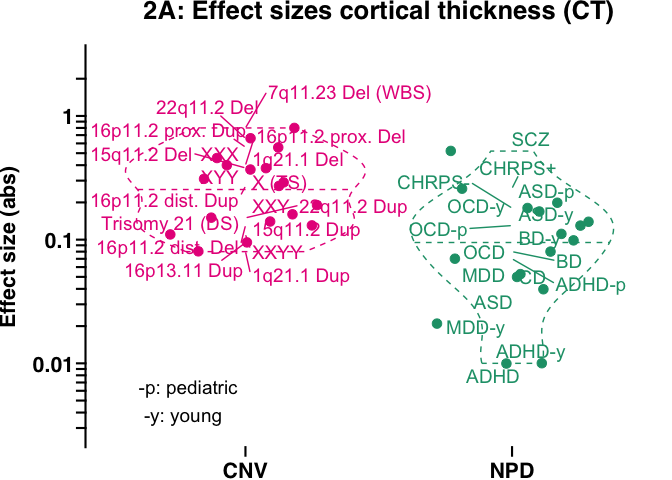
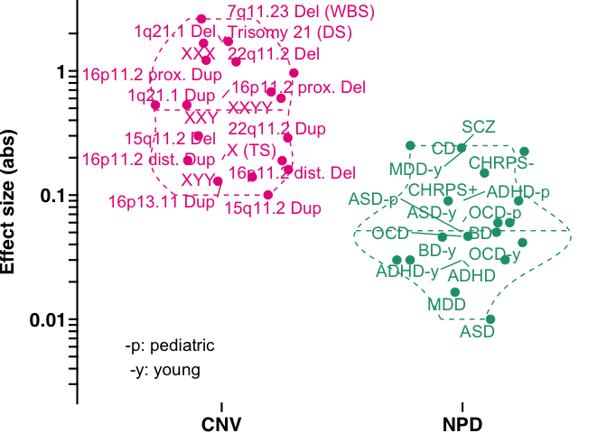
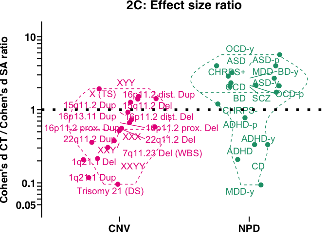
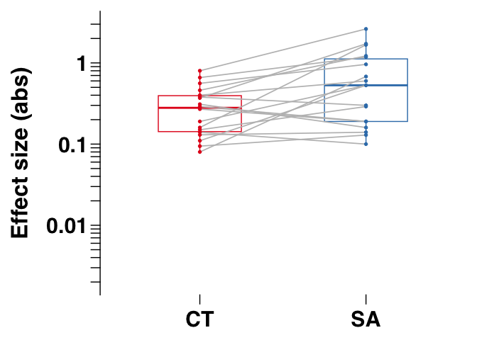
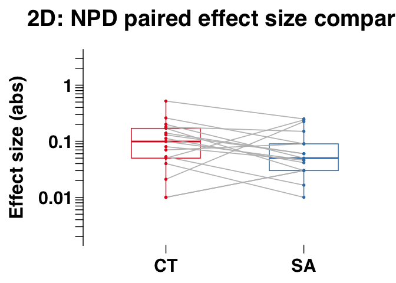
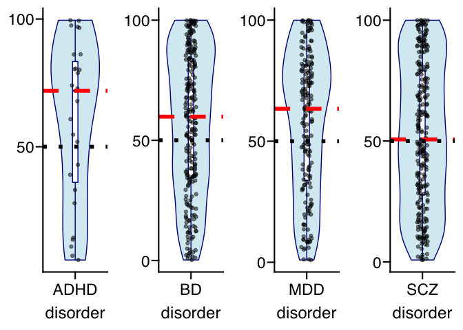

Fig2
================

## Fig. 2, statistics and panel figures a to e

Comparison between neurodevelopmental and psychiatric disorders (NPDs)
associated rare genetic liability (CNVs) and diagnosis on A) mean
cortical thickness (CT) effect sizes; B) total surface area (SA) effect
sizes; C) the ratio of CT and SA effect sizes; and D) paired CT and SA
effect sizes. E) Effects on CT and SA of common variants associated with
NPDs. We tested if NPD genome-wide significant SNPs were enriched in
SNPs associated with SA or CT. We ranked independent NPD-associated SNPs
based on their p-value association with CT and SA.

## Stats for Fig. 2, panel a to d

``` r
library(ggplot2)
library(ggprism)   # we use ggprism theme
library(ggrepel)

## Load data
load(file = paste0("data_fig2_fig3.RData"))

## subset to rare variants (CNV) and psychiatric disorder (NPD)
in_df_plot = data_fig2_fig3[which(data_fig2_fig3$Type %in% c("CNV","NPD")),]

## Absolute effect sizes
in_df_plot[,"abs_es_MeanCT"] = abs(in_df_plot[,"es_MeanCT"])
in_df_plot[,"abs_es_TotalSA"] = abs(in_df_plot[,"es_TotalSA"])


### Stats Fig. 2A, and 2B
# fold change and Wilcox ranksum test
test_metric = "abs_es_MeanCT"
fold_change_meanCT = median(in_df_plot[in_df_plot[,"Type"] == "CNV",test_metric])/median(in_df_plot[in_df_plot[,"Type"] == "NPD",test_metric])
w1 = wilcox.test(in_df_plot[in_df_plot[,"Type"] == "CNV",test_metric],in_df_plot[in_df_plot[,"Type"] == "NPD",test_metric])

test_metric = "abs_es_TotalSA"
fold_change_totalSA = median(in_df_plot[in_df_plot[,"Type"] == "CNV",test_metric])/median(in_df_plot[in_df_plot[,"Type"] == "NPD",test_metric])
w2 = wilcox.test(in_df_plot[in_df_plot[,"Type"] == "CNV",test_metric],in_df_plot[in_df_plot[,"Type"] == "NPD",test_metric])


p_array = c(w1$p.value,w2$p.value)
p_array_adj = p.adjust(p_array,method = "fdr")

df_fold_change_fig2A_2B = data.frame(metric = c("meanCT","totalSA"),
                            fold_change = round(c(fold_change_meanCT,fold_change_totalSA)),
                            pval = p_array,
                            pval_adj = p_array_adj)

print(df_fold_change_fig2A_2B)
```

    ##    metric fold_change        pval     pval_adj
    ## 1  meanCT           3 1.91355e-03 1.913550e-03
    ## 2 totalSA          11 1.40819e-05 2.816381e-05

``` r
## Stats: Fig. 2 C 
test_metric = "ratio_CT_SA"
# Differences in ratios between CNVs and NPDs
w1 = wilcox.test(in_df_plot[in_df_plot[,"Type"] == "CNV",test_metric],in_df_plot[in_df_plot[,"Type"] == "NPD",test_metric])

pvalue_ratio_CNV_vs_NPD = w1$p.value
print(paste0("Fig 2C: Stats comparing the distribution of effect size ratios between CNVs and NPDs, Wilcox ranksum p-value=",pvalue_ratio_CNV_vs_NPD))
```

    ## [1] "Fig 2C: Stats comparing the distribution of effect size ratios between CNVs and NPDs, Wilcox ranksum p-value=0.00713925949723505"

``` r
# Shift from a ratio of 1
w1 <- wilcox.test(in_df_plot[in_df_plot[,"Type"] == "CNV",test_metric],mu = 1,alternative = "less")
w2 <- wilcox.test(in_df_plot[in_df_plot[,"Type"] == "NPD",test_metric],mu = 1,alternative = "greater")

median_ratio_CNV = median(in_df_plot[in_df_plot[,"Type"] == "CNV",test_metric])
median_ratio_NPD = median(in_df_plot[in_df_plot[,"Type"] == "NPD",test_metric])

p_array = c(w1$p.value,w2$p.value)
p_array_adj = p.adjust(p_array,method = "fdr")

df_median_es_ratio_fig2C = data.frame(type = c("CNV","NPD"),
                            median_ratio = c(median_ratio_CNV,median_ratio_NPD),
                            pval = p_array,
                            pval_adj = p_array_adj)

print(df_median_es_ratio_fig2C)
```

    ##   type median_ratio        pval   pval_adj
    ## 1  CNV    0.5713277 0.029968262 0.02996826
    ## 2  NPD    2.1290323 0.005279354 0.01055871

``` r
## Stats: Fig. 2 D

w1 = wilcox.test(in_df_plot[in_df_plot[,"Type"] == "CNV","abs_es_MeanCT"],in_df_plot[in_df_plot[,"Type"] == "CNV","abs_es_TotalSA"],paired = TRUE)

w2 = wilcox.test(in_df_plot[in_df_plot[,"Type"] == "NPD","abs_es_MeanCT"],in_df_plot[in_df_plot[,"Type"] == "NPD","abs_es_TotalSA"],paired = TRUE)

p_array = c(w1$p.value,w2$p.value)
p_array_adj = p.adjust(p_array,method = "fdr")

df_paired_CT_and_SA_comparison_fig2D = data.frame(type = c("CNV","NPD"),
                            pval = p_array,
                            pval_adj = p_array_adj)

print(df_paired_CT_and_SA_comparison_fig2D)
```

    ##   type       pval   pval_adj
    ## 1  CNV 0.01017644 0.02035288
    ## 2  NPD 0.06479012 0.06479012

## Plot Fig. 2 A: meanCT

``` r
col_values_CNV_NPD = c("CNV" = "#e7298a","NPD" = "#1b9e77")
input_base_font_size = 16
input_label_font_size = 5


p_boxplot_CT = ggplot(in_df_plot, aes(x = Type, y = abs_es_MeanCT,color=Type)) +
  theme_prism(base_size = input_base_font_size,base_line_size = 0.75)+ 
  geom_violin(draw_quantiles = c(0.5),linetype = "dashed",trim = TRUE) +
  scale_color_manual(values = col_values_CNV_NPD)+
  geom_point(size = 3,position = position_jitter(width = 0.3))+
  geom_text_repel(aes(label=Column),size=input_label_font_size,min.segment.length=0.3,max.overlaps=20)+
  #geom_hline(yintercept = 0.1,linetype="dotted", color="black")+
  annotate("text",x=0.6,y= 0.005, size=input_label_font_size,label = paste("-p: pediatric","\n","-y: young"),hjust = 0)+
  xlab(NULL) + ylab("Effect size (abs)")+
  theme(text = element_text(size=input_base_font_size), axis.text.x =element_text(size=input_base_font_size),axis.text.y =element_text(size=input_base_font_size))+
  theme(axis.line.x = element_blank())+
  scale_y_continuous(trans = "log10",limits = c(0.00295,2.65),position = "left",breaks = c(seq(0.003,0.009,0.001),seq(0.01,0.09,0.01),seq(0.1,0.9,0.1),1,2),labels = c(rep("",7),0.01,rep("",8),0.1,rep("",8),1,""))+   
  theme(plot.margin = margin(0,0,0,0, "cm"))+
  theme(legend.position = "none")+
  ggtitle("2A: Effect sizes cortical thickness (CT)")

print(p_boxplot_CT)
```

<!-- -->

## Plot Fig. 2 B: totalSA

``` r
p_boxplot_SA = ggplot(in_df_plot, aes(x = Type, y = abs_es_TotalSA,color=Type)) +
  theme_prism(base_size = input_base_font_size,base_line_size = 0.75)+ 
  geom_violin(draw_quantiles = c(0.5),linetype = "dashed",trim = TRUE) +
  scale_color_manual(values = col_values_CNV_NPD)+
  geom_point(size = 3,position = position_jitter(width = 0.3))+
  geom_text_repel(aes(label=Column),size=input_label_font_size,min.segment.length=0.3,max.overlaps=20)+
  #geom_hline(yintercept = 0.1,linetype="dotted", color="black")+
  annotate("text",x=0.6,y= 0.005, size=input_label_font_size,label = paste("-p: pediatric","\n","-y: young"),hjust = 0)+
  xlab(NULL) + ylab("Effect size (abs)")+
  theme(text = element_text(size=input_base_font_size), axis.text.x =element_text(size=input_base_font_size),axis.text.y =element_text(size=input_base_font_size))+
  theme(axis.line.x = element_blank())+
  scale_y_continuous(trans = "log10",limits = c(0.00295,2.65),position = "left",breaks = c(seq(0.003,0.009,0.001),seq(0.01,0.09,0.01),seq(0.1,0.9,0.1),1,2),labels = c(rep("",7),0.01,rep("",8),0.1,rep("",8),1,""))+   
  theme(plot.margin = margin(0,0,0,0, "cm"))+
  theme(legend.position = "none") +
  ggtitle("2B: Effect sizes surface area (SA)")

print(p_boxplot_SA)
```

<!-- -->

## Plot Fig. 2 C: Effect size ratio

``` r
p_boxplot_es_ratio = ggplot(in_df_plot, aes(x = Type, y = ratio_CT_SA,color=Type)) +
  theme_prism(base_size = input_base_font_size,base_line_size = 0.75)+ 
  geom_violin(draw_quantiles = c(0.5),linetype = "dashed",trim = TRUE) +
  scale_color_manual(values = col_values_CNV_NPD)+
  geom_point(size = 3,position = position_jitter(width = 0.3))+
  geom_text_repel(aes(label=Column),size=input_label_font_size,min.segment.length=0.3,max.overlaps=20)+
  geom_hline(yintercept = 1,linetype="dotted", color="black",linewidth = 2)+
  #annotate("text",x=0.6,y= 0.005, size=input_label_font_size,label = paste("-p: pediatric","\n","-y: young"),hjust = 0)+
  xlab(NULL) + ylab("Cohen's d CT / Cohen's d SA ratio")+
  theme(text = element_text(size=input_base_font_size), axis.text.x =element_text(size=input_base_font_size),axis.text.y =element_text(size=input_base_font_size))+
  theme(axis.line.x = element_blank())+
  scale_y_continuous(trans = "log10",position = "left",limits = c(0.045,12),breaks = c(seq(0.05,0.09,0.01),seq(0.1,0.9,0.1),seq(1,9,1),10),labels = c(0.05,rep("",4),0.1,rep("",8),1,rep("",8),10))+  
  theme(plot.margin = margin(0,0,0,0, "cm"))+
  theme(legend.position = "none") +
  ggtitle("2C: Effect size ratio")
  
print(p_boxplot_es_ratio)
```

<!-- -->

## Plot Fig. 2 D: Paired boxplots for meanCT and totalSA comparison

``` r
library(ggpubr)
library(ggsignif)

col_values_metric = c("CT" = "#e41a1c", "SA" = "#377eb8")

## function to make ggpaired plot
ggpaired_boxplot = function(in_df_ggpaired){
  
  in_df_ggpaired[,"metric"] = factor(in_df_ggpaired[,"metric"],levels =c("CT","SA"))
  
  p_ggpaired = ggpaired(in_df_ggpaired, x = "metric", y = "ES",
           color = "metric", shape="metric",line.color = "gray", line.size = 0.6,palette = "jco")+
    theme_prism(base_size = 24,base_line_size = 0.5) +   
    scale_color_manual(values = col_values_metric)+
    theme(legend.position = "none")+
    scale_y_continuous(trans = "log10",limits = c(0.002,3),breaks = c(seq(0.002,0.009,0.001),seq(0.01,0.09,0.01),seq(0.1,0.9,0.1),1,2,3),labels = c(rep("",8),0.01,rep("",8),0.1,rep("",8),1,"",""))+   
    theme(axis.line.x = element_blank())+
    xlab(NULL) + ylab("Effect size (abs)")
  
  return(p_ggpaired)
  
}


in_df_plot_SA_CT_es = data.frame( Column = c(in_df_plot[,"Column"],in_df_plot[,"Column"]),
                                  Type = c(in_df_plot[,"Type"],in_df_plot[,"Type"]),
                                  metric = c(rep("CT",nrow(in_df_plot)),rep("SA",nrow(in_df_plot))),
                                  ES = c(abs(in_df_plot[,"es_MeanCT"]),abs(in_df_plot[,"es_TotalSA"])))

## CNV
in_df_ggpaired= in_df_plot_SA_CT_es[which(in_df_plot_SA_CT_es[,"Type"] == "CNV"),]
p_paired_boxplot_CNV = ggpaired_boxplot(in_df_ggpaired) +
  ggtitle("2D: CNV paired effect size comparison")
```

    ## Scale for colour is already present.
    ## Adding another scale for colour, which will replace the existing scale.

``` r
print("CNV paired boxplot between meanCT and totalSA effect sizes (abs)")
```

    ## [1] "CNV paired boxplot between meanCT and totalSA effect sizes (abs)"

``` r
print(p_paired_boxplot_CNV)
```

<!-- -->

``` r
## NPD
in_df_ggpaired= in_df_plot_SA_CT_es[which(in_df_plot_SA_CT_es[,"Type"] == "NPD"),]
p_paired_boxplot_NPD = ggpaired_boxplot(in_df_ggpaired) +
  ggtitle("2D: NPD paired effect size comparison")
```

    ## Scale for colour is already present.
    ## Adding another scale for colour, which will replace the existing scale.

``` r
print("NPD paired boxplot between meanCT and totalSA effect sizes (abs)")
```

    ## [1] "NPD paired boxplot between meanCT and totalSA effect sizes (abs)"

``` r
print(p_paired_boxplot_NPD)
```

<!-- -->

## Plot Fig. 2 E: Ranking NPD-associated SNPs in meanCT

``` r
# load simplified data (as full GWAS summary statistics are large)
load("data_fig2e_NPD_SNPs_ranking_in_meanCT_totalSA_GWAS.RData")


## Function to compute null median ranking by sampling
compute_null_median_ranking = function(gwas_data,highlight_snps,nmax_null){
  ## gwas_data == meanCT or totalSA full GWAS summary statistics data
  ## highlight_snps = NPD GWAS significant SNPs
  
  ## Compute the empirical median rank for NPD GWAS significant SNPs
  highlight_indices <- which(gwas_data$SNP %in% highlight_snps)
  select_snp_percentiles = gwas_data[highlight_indices,"Percentile_P"]
  median_percentile_disorder = median(select_snp_percentiles,na.rm = TRUE)
  
  
  array_median_rank_null = c()
  
  for(loop_null in c(1:nmax_null)){

    set.seed(loop_null)
    null_index <- sample(1:nrow(gwas_data), length(highlight_indices))
    null_profile_percentiles = gwas_data[null_index,"Percentile_P"]
    median_percentile_null = median(null_profile_percentiles)
    
  array_median_rank_null = c(array_median_rank_null,median_percentile_null)
  }
  
  temp_pval_high = length(which( c(array_median_rank_null,median_percentile_disorder) >= median_percentile_disorder))/nmax_null
  temp_pval_low = length(which( c(array_median_rank_null,median_percentile_disorder) <= median_percentile_disorder))/nmax_null
   
  temp_pval_median_rank = min(temp_pval_high,temp_pval_low)
   
  return(temp_pval_median_rank)
}

## Pre-computed p-values using null permutation model
array_pvals_CT = c(8.8e-2,5.9e-2,2.3e-1,1.4e-2)
array_pval_CT_fdr = p.adjust(array_pvals_CT,method = 'fdr')
# FDR p-values for shift of the median from 50th percentile
array_pval_CT_fdr
```

    ## [1] 0.1173333 0.1173333 0.2300000 0.0560000

``` r
## function to make jitter boxplot for the ranking of NPD GWAS signif SNPs in the meanCT or totalSA GWAS 
NPD_snp_ranking_jitter_boxplot = function(df){
  
  median_percentile_disorder = median(df[,"value"])
  
  # Create the boxplot
  p1_ranking = ggplot(df, aes(y = value,x=disorder)) +
    theme_prism(base_size = 18,base_line_size = 0.75,base_rect_size = 0.75,base_fontface = "plain")+
    geom_violin(fill = "lightblue", color = "darkblue", alpha = 0.5) +
    geom_boxplot(width = 0.1, fill = "white", color = "darkblue") +
    geom_jitter(width = 0.1, alpha = 0.5) +
    geom_hline(yintercept = median_percentile_disorder, color = "red", linetype = "dashed",linewidth =2) +
    geom_hline(yintercept = 50, color = "black", linetype = "dotted",linewidth =2) +
    labs(y = NULL) +
    #theme(axis.title.x=element_blank(),axis.text.x=element_blank()) + 
    scale_y_continuous(breaks=c(0,50,100),labels=c(0,50,100))
    
  return(p1_ranking)
}

input_metric = "meanCT"

array_PGC_GWAS_disorder_names = c("ADHD","BD","MDD","SCZ")
desired_length <- length(array_PGC_GWAS_disorder_names)
list_plots_CT <- vector(mode = "list", length = desired_length)


for(loop_d in c(1:length(array_PGC_GWAS_disorder_names))){
  input_df = df_NPD_SNPs_ranking[which( (df_NPD_SNPs_ranking[,"metric"] == input_metric) & (df_NPD_SNPs_ranking[,"NPD"] == array_PGC_GWAS_disorder_names[loop_d])),]
  
  NPD_gwas_signif_snp_percentiles = input_df[,"Percentile_P"]
    
  df <- data.frame(value = 100*NPD_gwas_signif_snp_percentiles,
                   disorder = rep(array_PGC_GWAS_disorder_names[loop_d],length(NPD_gwas_signif_snp_percentiles)))
  
  list_plots_CT[[loop_d]] = NPD_snp_ranking_jitter_boxplot(df)
  
}

p_NPD_GWAS_signif_SNPs_ranking_in_meanCT = ggarrange(plotlist = list_plots_CT,nrow = 1,align = "v")


p_NPD_GWAS_signif_SNPs_ranking_in_meanCT = p_NPD_GWAS_signif_SNPs_ranking_in_meanCT  +
  ggtitle("2E: Ranking NPD SNPs in meanCT cortical GWAS") + ylab("CT %")

## Plot of ranking of PGC NPD GWAS significant SNPs in meanCT GWAS (Grasby 2020)
print(p_NPD_GWAS_signif_SNPs_ranking_in_meanCT)
```

<!-- -->

## Plot Fig. 2 E: Ranking NPD-associated SNPs in totalSA

``` r
input_metric = "totalSA"

## Pre-computed p-values using null permutation model
array_pvals_SA = c(1e-3,2e-3,1e-3,4.3e-1)
array_pval_SA_fdr = p.adjust(array_pvals_SA,method = 'fdr')
# FDR p-values for shift of the median from 50th percentile
array_pval_SA_fdr
```

    ## [1] 0.002000000 0.002666667 0.002000000 0.430000000

``` r
list_plots_SA <- vector(mode = "list", length = desired_length)


for(loop_d in c(1:length(array_PGC_GWAS_disorder_names))){
  input_df = df_NPD_SNPs_ranking[which( (df_NPD_SNPs_ranking[,"metric"] == input_metric) & (df_NPD_SNPs_ranking[,"NPD"] == array_PGC_GWAS_disorder_names[loop_d])),]
  
  NPD_gwas_signif_snp_percentiles = input_df[,"Percentile_P"]
    
  df <- data.frame(value = 100*NPD_gwas_signif_snp_percentiles,
                   disorder = rep(array_PGC_GWAS_disorder_names[loop_d],length(NPD_gwas_signif_snp_percentiles)))
  
  list_plots_SA[[loop_d]] = NPD_snp_ranking_jitter_boxplot(df)
  
}

p_NPD_GWAS_signif_SNPs_ranking_in_totalSA = ggarrange(plotlist = list_plots_SA,nrow = 1)

p_NPD_GWAS_signif_SNPs_ranking_in_totalSA = p_NPD_GWAS_signif_SNPs_ranking_in_totalSA  +
  ggtitle("2E: Ranking NPD SNPs in totalSA cortical GWAS") + ylab("SA %")

## Plot of ranking of PGC NPD GWAS significant SNPs in totalSA GWAS (Grasby 2020)
print(p_NPD_GWAS_signif_SNPs_ranking_in_totalSA)
```

<!-- -->
