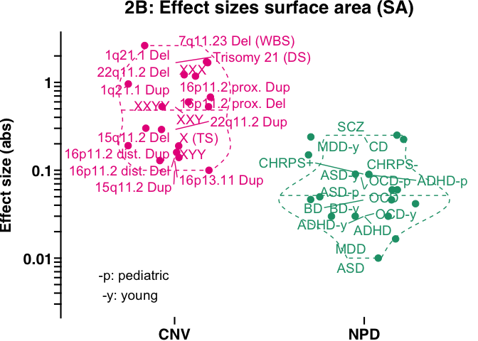
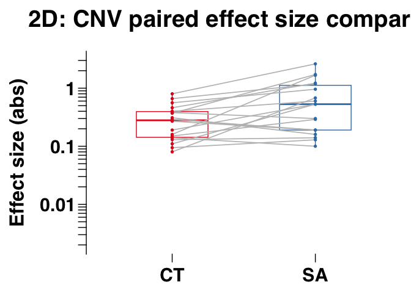
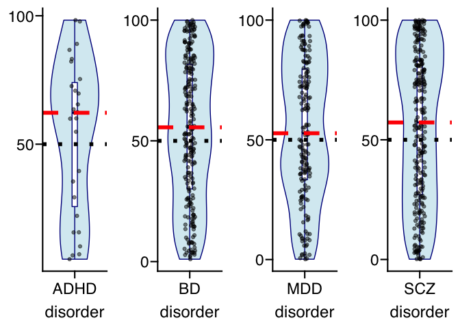

Fig2
================

## Figure 2, panel a to e

## Stats for Figure 2, panel a to d

``` r
library(ggplot2)
```

    ## Warning: package 'ggplot2' was built under R version 4.2.3

``` r
library(ggprism)   # we use ggprism theme
```

    ## Warning: package 'ggprism' was built under R version 4.2.3

``` r
library(ggrepel)

## Load data
load(file = paste0("data_fig2_fig3.RData"))

## subset to rare variants (CNV) and psychiatric disorder (NPD)
in_df_plot = data_fig2_fig3[which(data_fig2_fig3$Type %in% c("CNV","NPD")),]

## Absolute effect sizes
in_df_plot[,"abs_es_MeanCT"] = abs(in_df_plot[,"es_MeanCT"])
in_df_plot[,"abs_es_TotalSA"] = abs(in_df_plot[,"es_TotalSA"])


### Stats Figure 2A, and 2B
# fold change and Wilcox ranksum test
test_metric = "abs_es_MeanCT"
fold_change_meanCT = median(in_df_plot[in_df_plot[,"Type"] == "CNV",test_metric])/median(in_df_plot[in_df_plot[,"Type"] == "NPD",test_metric])
w1 = wilcox.test(in_df_plot[in_df_plot[,"Type"] == "CNV",test_metric],in_df_plot[in_df_plot[,"Type"] == "NPD",test_metric])
```

    ## Warning in wilcox.test.default(in_df_plot[in_df_plot[, "Type"] == "CNV", :
    ## cannot compute exact p-value with ties

``` r
test_metric = "abs_es_TotalSA"
fold_change_totalSA = median(in_df_plot[in_df_plot[,"Type"] == "CNV",test_metric])/median(in_df_plot[in_df_plot[,"Type"] == "NPD",test_metric])
w2 = wilcox.test(in_df_plot[in_df_plot[,"Type"] == "CNV",test_metric],in_df_plot[in_df_plot[,"Type"] == "NPD",test_metric])
```

    ## Warning in wilcox.test.default(in_df_plot[in_df_plot[, "Type"] == "CNV", :
    ## cannot compute exact p-value with ties

``` r
p_array = c(w1$p.value,w2$p.value)
p_array_adj = p.adjust(p_array,method = "fdr")

df_fold_change_fig2A_2B = data.frame(metric = c("meanCT","totalSA"),
                            fold_change = round(c(fold_change_meanCT,fold_change_totalSA)),
                            pval = p_array,
                            pval_adj = p_array_adj)

print(df_fold_change_fig2A_2B)
```

    ##    metric fold_change        pval     pval_adj
    ## 1  meanCT           3 1.91355e-03 1.913550e-03
    ## 2 totalSA          11 1.40819e-05 2.816381e-05

``` r
## Stats: Figure 2 C 
test_metric = "ratio_CT_SA"
# Differences in ratios between CNVs and NPDs
w1 = wilcox.test(in_df_plot[in_df_plot[,"Type"] == "CNV",test_metric],in_df_plot[in_df_plot[,"Type"] == "NPD",test_metric])
```

    ## Warning in wilcox.test.default(in_df_plot[in_df_plot[, "Type"] == "CNV", :
    ## cannot compute exact p-value with ties

``` r
pvalue_ratio_CNV_vs_NPD = w1$p.value
print(paste0("Fig 2C: Stats comparing the distribution of effect size ratios between CNVs and NPDs, Wilcox ranksum p-value=",pvalue_ratio_CNV_vs_NPD))
```

    ## [1] "Fig 2C: Stats comparing the distribution of effect size ratios between CNVs and NPDs, Wilcox ranksum p-value=0.00713925949723505"

``` r
# Shift from a ratio of 1
w1 <- wilcox.test(in_df_plot[in_df_plot[,"Type"] == "CNV",test_metric],mu = 1,alternative = "less")
w2 <- wilcox.test(in_df_plot[in_df_plot[,"Type"] == "NPD",test_metric],mu = 1,alternative = "greater")
```

    ## Warning in wilcox.test.default(in_df_plot[in_df_plot[, "Type"] == "NPD", :
    ## cannot compute exact p-value with ties

``` r
median_ratio_CNV = median(in_df_plot[in_df_plot[,"Type"] == "CNV",test_metric])
median_ratio_NPD = median(in_df_plot[in_df_plot[,"Type"] == "NPD",test_metric])

p_array = c(w1$p.value,w2$p.value)
p_array_adj = p.adjust(p_array,method = "fdr")

df_median_es_ratio_fig2C = data.frame(type = c("CNV","NPD"),
                            median_ratio = c(median_ratio_CNV,median_ratio_NPD),
                            pval = p_array,
                            pval_adj = p_array_adj)

print(df_median_es_ratio_fig2C)
```

    ##   type median_ratio        pval   pval_adj
    ## 1  CNV    0.5713277 0.029968262 0.02996826
    ## 2  NPD    2.1290323 0.005279354 0.01055871

``` r
## Stats: Figure 2 D

w1 = wilcox.test(in_df_plot[in_df_plot[,"Type"] == "CNV","abs_es_MeanCT"],in_df_plot[in_df_plot[,"Type"] == "CNV","abs_es_TotalSA"],paired = TRUE)
```

    ## Warning in wilcox.test.default(in_df_plot[in_df_plot[, "Type"] == "CNV", :
    ## cannot compute exact p-value with ties

``` r
w2 = wilcox.test(in_df_plot[in_df_plot[,"Type"] == "NPD","abs_es_MeanCT"],in_df_plot[in_df_plot[,"Type"] == "NPD","abs_es_TotalSA"],paired = TRUE)
```

    ## Warning in wilcox.test.default(in_df_plot[in_df_plot[, "Type"] == "NPD", :
    ## cannot compute exact p-value with ties

``` r
p_array = c(w1$p.value,w2$p.value)
p_array_adj = p.adjust(p_array,method = "fdr")

df_paired_CT_and_SA_comparison_fig2D = data.frame(type = c("CNV","NPD"),
                            pval = p_array,
                            pval_adj = p_array_adj)

print(df_paired_CT_and_SA_comparison_fig2D)
```

    ##   type       pval   pval_adj
    ## 1  CNV 0.01017644 0.02035288
    ## 2  NPD 0.06479012 0.06479012

## Plot Figure 2 A: meanCT

<!-- -->

## Plot Figure 2 B: totalSA

<!-- -->

## Plot Figure 2 C: Effect size ratio

<!-- -->

## Plot Figure 2 D: Paired boxplots for meanCT and totalSA comparison

    ## Scale for colour is already present.
    ## Adding another scale for colour, which will replace the existing scale.

    ## [1] "CNV paired boxplot between meanCT and totalSA effect sizes (abs)"

<!-- -->

    ## Scale for colour is already present.
    ## Adding another scale for colour, which will replace the existing scale.

    ## [1] "NPD paired boxplot between meanCT and totalSA effect sizes (abs)"

<!-- -->

## Plot Figure 2 E: Ranking NPD-associated SNPs in meanCT

    ## [1] 0.1173333 0.1173333 0.2300000 0.0560000

<!-- -->

## Plot Figure 2 E: Ranking NPD-associated SNPs in totalSA

    ## [1] 0.002000000 0.002666667 0.002000000 0.430000000

<!-- -->

Note that the `echo = FALSE` parameter was added to the code chunk to
prevent printing of the R code that generated the plot.
