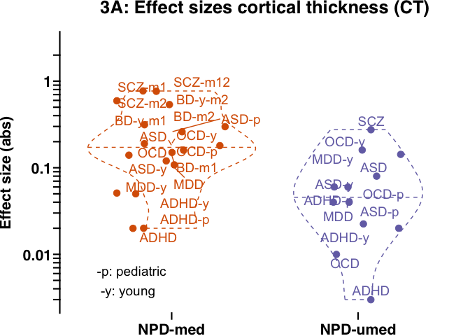
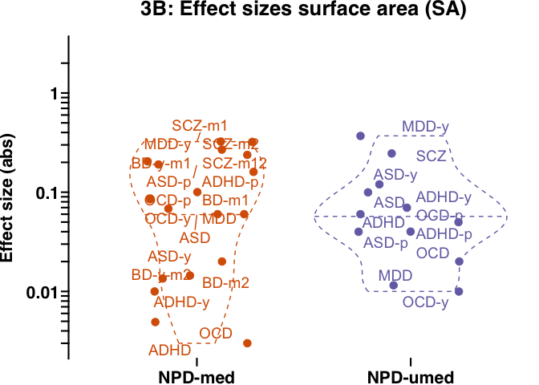
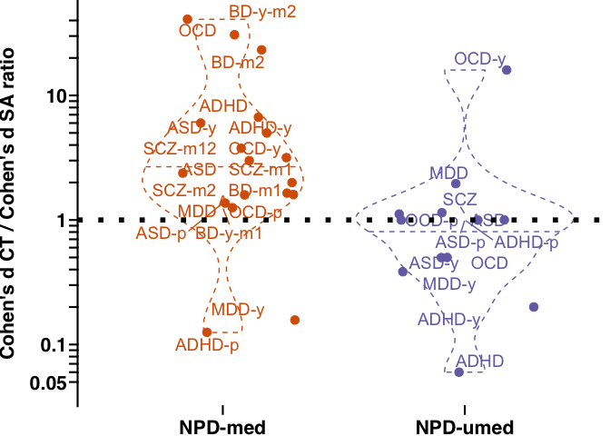
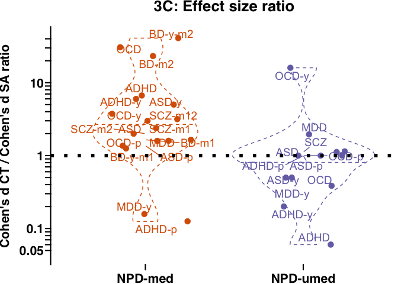
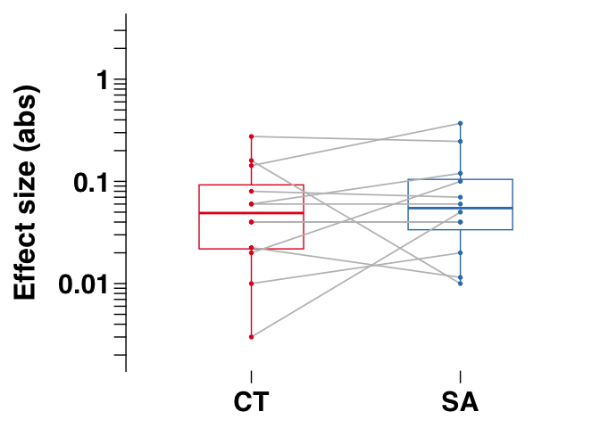

Fig3
================

## Figure 3

## Stats for Figure 3, panel a to c

``` r
library(ggplot2)
```

    ## Warning: package 'ggplot2' was built under R version 4.2.3

``` r
library(ggprism)   # we use ggprism theme
```

    ## Warning: package 'ggprism' was built under R version 4.2.3

``` r
library(ggrepel)

## Load data
load(file = paste0("data_fig2_fig3.RData"))

## subset to rare variants (CNV) and psychiatric disorder (NPD)
in_df_plot = data_fig2_fig3[which(data_fig2_fig3$Type %in% c("NPD-med","NPD-umed")),]

## Absolute effect sizes
in_df_plot[,"abs_es_MeanCT"] = abs(in_df_plot[,"es_MeanCT"])
in_df_plot[,"abs_es_TotalSA"] = abs(in_df_plot[,"es_TotalSA"])


### Stats Figure 3A, and 3B
# fold change and Wilcox ranksum test
test_metric = "abs_es_MeanCT"
fold_change_meanCT = median(in_df_plot[in_df_plot[,"Type"] == "NPD-med",test_metric])/median(in_df_plot[in_df_plot[,"Type"] == "NPD-umed",test_metric])
w1 = wilcox.test(in_df_plot[in_df_plot[,"Type"] == "NPD-med",test_metric],in_df_plot[in_df_plot[,"Type"] == "NPD-umed",test_metric])
```

    ## Warning in wilcox.test.default(in_df_plot[in_df_plot[, "Type"] == "NPD-med", :
    ## cannot compute exact p-value with ties

``` r
test_metric = "abs_es_TotalSA"
fold_change_totalSA = median(in_df_plot[in_df_plot[,"Type"] == "NPD-med",test_metric])/median(in_df_plot[in_df_plot[,"Type"] == "NPD-umed",test_metric])
w2 = wilcox.test(in_df_plot[in_df_plot[,"Type"] == "NPD-med",test_metric],in_df_plot[in_df_plot[,"Type"] == "NPD-umed",test_metric])
```

    ## Warning in wilcox.test.default(in_df_plot[in_df_plot[, "Type"] == "NPD-med", :
    ## cannot compute exact p-value with ties

``` r
p_array = c(w1$p.value,w2$p.value)
p_array_adj = p.adjust(p_array,method = "fdr")

df_fold_change_fig3A_3B = data.frame(metric = c("meanCT","totalSA"),
                            fold_change = round(c(fold_change_meanCT,fold_change_totalSA)),
                            pval = p_array,
                            pval_adj = p_array_adj)

print(df_fold_change_fig3A_3B)
```

    ##    metric fold_change        pval  pval_adj
    ## 1  meanCT           3 0.009756302 0.0195126
    ## 2 totalSA           1 0.734633249 0.7346332

``` r
## (OPTIONAL) Stats:  Effect size ratio 
test_metric = "ratio_CT_SA"
# Differences in ratios between CNVs and NPDs
w1 = wilcox.test(in_df_plot[in_df_plot[,"Type"] == "NPD-med",test_metric],in_df_plot[in_df_plot[,"Type"] == "NPD-umed",test_metric])
```

    ## Warning in wilcox.test.default(in_df_plot[in_df_plot[, "Type"] == "NPD-med", :
    ## cannot compute exact p-value with ties

``` r
pvalue_ratio_NPDmed_vs_NPDumed = w1$p.value
print(paste0("Fig 3: Stats comparing the distribution of effect size ratios between NPD-med and NPD-umed, Wilcox ranksum p-value=",pvalue_ratio_NPDmed_vs_NPDumed))
```

    ## [1] "Fig 3: Stats comparing the distribution of effect size ratios between NPD-med and NPD-umed, Wilcox ranksum p-value=0.00424853604667147"

``` r
# Shift from a ratio of 1
w1 <- wilcox.test(in_df_plot[in_df_plot[,"Type"] == "NPD-med",test_metric],mu = 1,alternative = "greater")
w2 <- wilcox.test(in_df_plot[in_df_plot[,"Type"] == "NPD-umed",test_metric],mu = 1,alternative = "greater")
```

    ## Warning in wilcox.test.default(in_df_plot[in_df_plot[, "Type"] == "NPD-umed", :
    ## cannot compute exact p-value with ties

    ## Warning in wilcox.test.default(in_df_plot[in_df_plot[, "Type"] == "NPD-umed", :
    ## cannot compute exact p-value with zeroes

``` r
median_ratio_NPDmed = median(in_df_plot[in_df_plot[,"Type"] == "NPD-med",test_metric])
median_ratio_NPDumed = median(in_df_plot[in_df_plot[,"Type"] == "NPD-umed",test_metric])

p_array = c(w1$p.value,w2$p.value)
p_array_adj = p.adjust(p_array,method = "fdr")

df_median_es_ratio_fig3x = data.frame(type = c("NPD-medicated","NPD-unmedicated"),
                            median_ratio = c(median_ratio_NPDmed,median_ratio_NPDumed),
                            pval = p_array,
                            pval_adj = p_array_adj)

print(df_median_es_ratio_fig3x)
```

    ##              type median_ratio         pval     pval_adj
    ## 1   NPD-medicated     2.691589 0.0003356934 0.0006713867
    ## 2 NPD-unmedicated     1.000000 0.6389754289 0.6389754289

``` r
## Stats: Figure 3 C

w1 = wilcox.test(in_df_plot[in_df_plot[,"Type"] == "NPD-med","abs_es_MeanCT"],in_df_plot[in_df_plot[,"Type"] == "NPD-med","abs_es_TotalSA"],paired = TRUE)

w2 = wilcox.test(in_df_plot[in_df_plot[,"Type"] == "NPD-umed","abs_es_MeanCT"],in_df_plot[in_df_plot[,"Type"] == "NPD-umed","abs_es_TotalSA"],paired = TRUE)
```

    ## Warning in wilcox.test.default(in_df_plot[in_df_plot[, "Type"] == "NPD-umed", :
    ## cannot compute exact p-value with zeroes

``` r
p_array = c(w1$p.value,w2$p.value)
p_array_adj = p.adjust(p_array,method = "fdr")

df_paired_CT_and_SA_comparison_fig3C = data.frame(type = c("NPD-medicated","NPD-unmedicated"),
                            pval = p_array,
                            pval_adj = p_array_adj)

print(df_paired_CT_and_SA_comparison_fig3C)
```

    ##              type        pval   pval_adj
    ## 1   NPD-medicated 0.006576538 0.01315308
    ## 2 NPD-unmedicated 0.477196620 0.47719662

## Plot Figure 3 A: meanCT

<!-- -->

## Plot Figure 3 B: totalSA

<!-- -->

## Plot Figure 3 x: Effect size ratio

<!-- -->

## Plot Figure 3 C: Paired boxplots for meanCT and totalSA comparison

    ## Scale for colour is already present.
    ## Adding another scale for colour, which will replace the existing scale.

    ## [1] "NPD-medicated paired boxplot between meanCT and totalSA effect sizes (abs)"

<!-- -->

    ## Scale for colour is already present.
    ## Adding another scale for colour, which will replace the existing scale.

    ## [1] "NPD-unmedicated paired boxplot between meanCT and totalSA effect sizes (abs)"

<!-- --> Note that the
`echo = FALSE` parameter was added to the code chunk to prevent printing
of the R code that generated the plot.
