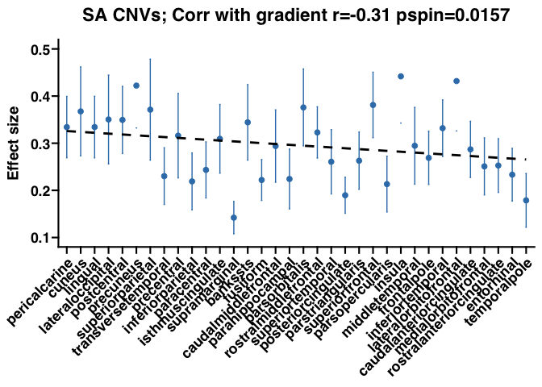

Fig4
================

## Fig. 4: statistics and panel figures

Panel A) number of FDR significant cortical regions (out of 34) per
CNV/NPD for cortical thickness (up, red) and surface area (down, blue).
B) Regional profiles of twin heritability, and mean absolute effect
sizes across common and rare genetic variants and NPDs for cortical
thickness and surface area across 34 Desikan cortical regions. Each
point represents: i) First two: the twin heritability and 95% CI; ii)
third: mean estimate from linear regression for NPD associated common
variants (SA NPD-SNPs); and iii) bottom four: mean absolute effect size
(Cohen’s d), with error bars showing the standard error of the mean.
X-axis: cortical regions ordered according to the cortical gradient from
sensorimotor to association regions. Dotted line: correlation with the
cortical gradient.

## Plot Fig. 4 A: Number of FDR significant cortical regions CNV and NPDs

``` r
library(ggplot2)
library(ggprism)   # we use ggprism theme
library(ggrepel)
library(dplyr)
```

    ## 
    ## Attaching package: 'dplyr'

    ## The following objects are masked from 'package:stats':
    ## 
    ##     filter, lag

    ## The following objects are masked from 'package:base':
    ## 
    ##     intersect, setdiff, setequal, union

``` r
## Load data for 4A
load(file = paste0("data_fig4a_es_pval_CNVs_NPDs.RData"))

## 1. function to apply FDR across a matrix of p-values
fPval_adj_in_mat <- function(in_pval_mat,padj_method='fdr'){
  
  in_pval_mat_FDR <- matrix(p.adjust(as.vector(as.matrix(in_pval_mat)), method=padj_method),ncol=ncol(in_pval_mat))
  
  return(in_pval_mat_FDR)
}

## 2. Function to count number of FDR significant ROIs per CNV/NPD
count_nfdr_rois = function(df_pval_CT_adj,df_pval_SA_adj){
  #num_cols <- ncol(df_pval_CT_adj)
  exp_names <- colnames(df_pval_CT_adj) # Assuming column names are the same in both data frames
  nsig_fdr_CT <- colSums(df_pval_CT_adj < 0.05)
  nsig_fdr_SA <- colSums(df_pval_SA_adj < 0.05)

  df_nfdr_rois_CT_SA <- data.frame(
    exp_names = exp_names,
    nsig_fdr_CT = nsig_fdr_CT,
    nsig_fdr_SA = nsig_fdr_SA
  )
  return(df_nfdr_rois_CT_SA)

}

## 3. Function to make barplot with number of FDR signif ROIs per CNV/NPD
##
col_values_metric = c("CT" = "#e41a1c", "SA" = "#377eb8")

barplot_nfdr <- function(df_subset, current_type) {
  
  # Calculate means for lines
  mean_CT <- mean(df_subset$nsig_fdr_CT)
  mean_SA <- mean(df_subset$nsig_fdr_SA)
  
  p <- ggplot(df_subset, aes(x = exp_names)) +
    geom_bar(aes(y = nsig_fdr_CT), stat = "identity", fill = "#e41a1c", color = "black") +
    geom_bar(aes(y = -nsig_fdr_SA), stat = "identity", fill = "#377eb8", color = "black") +  # Negative for flipped axis
    
    # Add values on top of bars
    geom_text(aes(y = nsig_fdr_CT, label = nsig_fdr_CT), vjust = -1, size = 3) + # vjust = -0.5,
    geom_text(aes(y = -nsig_fdr_SA, label = nsig_fdr_SA), vjust = 1.5, size = 3) + # vjust = 1.5,
    scale_y_continuous(
      limits = c(-35,35),
      breaks = seq(-30, 30, by = 10),   
      labels = function(x) ifelse(x < 0, -x, x) # Show positive values on both sides
    ) +  
    labs(title = NULL, x = NULL, y = "Count") +
    theme_bw() +
    theme(axis.text.x = element_text(angle = 45, hjust = 1)) # Rotate x-axis labels if needed
  
  #print(p)
  return(p)
}


## 1. FDR across regional CT and SA p-values for CNVs
p_stacked_CNVs = cbind(df_pval_CT_CNVs,df_pval_SA_CNVs)
p_stacked_CNVs_Adj = as.data.frame(fPval_adj_in_mat(p_stacked_CNVs,padj_method='fdr'))
df_pval_CT_CNVs_adj = as.data.frame(p_stacked_CNVs_Adj[,c(1:ncol(df_pval_CT_CNVs))])
df_pval_SA_CNVs_adj = as.data.frame(p_stacked_CNVs_Adj[,c( (ncol(df_pval_CT_CNVs) + 1):ncol(p_stacked_CNVs_Adj))])
colnames(df_pval_CT_CNVs_adj) = colnames(df_pval_CT_CNVs)
colnames(df_pval_SA_CNVs_adj) = colnames(df_pval_SA_CNVs)
  
## Count number of FDR signficant ROIs
df_nfdr_rois_CT_SA_CNVs = count_nfdr_rois(df_pval_CT_CNVs_adj,df_pval_SA_CNVs_adj)

## Make barplot
df = df_nfdr_rois_CT_SA_CNVs
current_type = "CNV"
pbar_n_fdr_cnv = barplot_nfdr(df, current_type) + ggtitle("CNV: # FDR signif ROIs (max= 34 Desikan ROIs)")
print(pbar_n_fdr_cnv)
```

<!-- -->

``` r
## 2. FDR across regional CT and SA p-values for NPDs
p_stacked_NPDs = cbind(df_pval_CT_NPDs_all,df_pval_SA_NPDs_all)
p_stacked_NPDs_Adj = as.data.frame(fPval_adj_in_mat(p_stacked_NPDs,padj_method='fdr'))

df_pval_CT_NPDs_adj = as.data.frame(p_stacked_NPDs_Adj[,c(1:ncol(df_pval_CT_NPDs_all))])
df_pval_SA_NPDs_adj = as.data.frame(p_stacked_NPDs_Adj[,c( (ncol(df_pval_CT_NPDs_all) + 1):ncol(p_stacked_NPDs_Adj))])
colnames(df_pval_CT_NPDs_adj) = colnames(df_pval_CT_NPDs_all)
colnames(df_pval_SA_NPDs_adj) = colnames(df_pval_SA_NPDs_all)

## Count number of FDR signficant ROIs
df_nfdr_rois_CT_SA_NPDs = count_nfdr_rois(df_pval_CT_NPDs_adj,df_pval_SA_NPDs_adj)

## Make barplot
df = df_nfdr_rois_CT_SA_NPDs
current_type = "NPD"
pbar_n_fdr_npd = barplot_nfdr(df, current_type) + ggtitle("NPD: # FDR signif ROIs (max= 34 Desikan ROIs)")
print(pbar_n_fdr_npd)
```

<!-- -->

## Statistics Fig. 4 B: Regional profiles of CT and SA twin heritability and concensus maps (mean absolute effect sizes)

``` r
## 1. load data for Fig. 4B
# a. Regional twin hearitability estimates from Grasby 2020 
load("data_fig4b_twin_h2_CT_SA.RData") ## loads df: data_fig4b_twin_h2 ## NOTE: SA are adjusted for total SA

# b. Mean absolute effect sizes + SE for CNVs, NPDs, and NPD-SNPs
load(file = paste0("data_fig4b_meanAbsES_SNPs_CNVs_NPDs.RData")) ## loads df: data_fig4b

## 2. Statistics: Correlation + spin permutation p-value with cortical gradient

# function to compute correlation with a reference profile + spin permutation p-value
load("df_perm_ids_DesikanLH34_nIterNull_10000.RData")  # pre-compute NULL spin rotations

# # A .------ Spin Perm test --------------------
get_pspin = function(x,y,perm.id,corr.type='pearson') {
  
  nroi = dim(perm.id)[1]  # number of regions
  nperm = dim(perm.id)[2] # number of permutations
  
  corr_emp = cor(x,y,method=corr.type)  # empirical correlation
  
  # permutation of measures
  x.perm = y.perm = array(NA,dim=c(nroi,nperm))
  for (r in 1:nperm) {
    for (i in 1:nroi) {
      x.perm[i,r] = x[perm.id[i,r]]
      y.perm[i,r] = y[perm.id[i,r]]
    }
  }
  
  # correlation to unpermuted measures
  rho.null.xy = rho.null.yx = vector(length=nperm)
  for (r in 1:nperm) {
    rho.null.xy[r] = cor(x.perm[,r],y,method=corr.type)
    rho.null.yx[r] = cor(y.perm[,r],x,method=corr.type)
  }
  
  # p-value definition depends on the sign of the empirical correlation
  if (corr_emp>0) {
    p_xy = sum(rho.null.xy>corr_emp)/nperm
    p_yx = sum(rho.null.yx>corr_emp)/nperm
  } else {
    p_xy = sum(rho.null.xy<corr_emp)/nperm
    p_yx = sum(rho.null.yx<corr_emp)/nperm
  }
  
  # return average p-value
  pval_avg <- (p_xy+p_yx)/2
  
  # check if p-value is 0; set to minimum or 1/nperm
  if(pval_avg == 0){
    pval_avg = 1/nperm
  }
  
  return(pval_avg)
  
}


cor_pspin_with_gradient = function(df_map_mat,ref_profile,df_perm_ids_LH,corr.type){
  
  array_map_name = c()
  array_cor = c()
  array_pspin = c()
    for( loop_a in c(1:ncol(df_map_mat))){
      
      array_map_name = c(array_map_name,colnames(df_map_mat)[loop_a])
      
      temp_cor = cor(df_map_mat[c(1:34),loop_a],ref_profile)
      temp_pspin = get_pspin(df_map_mat[c(1:34),loop_a],ref_profile,perm.id = df_perm_ids_LH,corr.type=corr.type)
      
      array_cor = c(array_cor,temp_cor)
      array_pspin = c(array_pspin,temp_pspin)
    }
  
  df_cor_pspin_with_ref = data.frame(map = array_map_name,
                                     cor = array_cor,
                                     pspin = array_pspin)
  
  return(df_cor_pspin_with_ref)
}


## Make a df of all 7 maps (ROIs are ordered along ggseg Desikan ROIs order)
df_regional_maps = data.frame(twin_h2_CT = data_fig4b_twin_h2[,"twin_h2_CT"],                         twin_h2_SA = data_fig4b_twin_h2[,"twin_h2_SA"],
SNPs_NPD_SA = data_fig4b[,"meanES_SA_NPD_SNPs"], 
CNVs_CT = data_fig4b[,"meanES_CT_CNVs"],
CNVs_SA = data_fig4b[,"meanES_SA_CNVs"],
NPDs_CT = data_fig4b[,"meanES_CT_NPDs"],
NPDs_SA = data_fig4b[,"meanES_SA_NPDs"])

## Correlation with gradient (transcriptomics: PC1 of AHBA gene-expression)
array_cortical_gradient = data_fig4b[,"cortical_gradient"]

df_cor_pspin_with_gradient_fig4b = cor_pspin_with_gradient(df_map_mat = df_regional_maps,ref_profile = array_cortical_gradient,df_perm_ids_LH,corr.type="pearson")
 
print("Statistics: correlations of regional profiles with cortical gradient")
```

    ## [1] "Statistics: correlations of regional profiles with cortical gradient"

``` r
print(df_cor_pspin_with_gradient_fig4b)
```

    ##           map        cor   pspin
    ## 1  twin_h2_CT -0.7463066 0.00095
    ## 2  twin_h2_SA -0.6862667 0.00140
    ## 3 SNPs_NPD_SA -0.4808848 0.02420
    ## 4     CNVs_CT -0.4251978 0.00950
    ## 5     CNVs_SA -0.3105644 0.01565
    ## 6     NPDs_CT  0.2834364 0.09290
    ## 7     NPDs_SA  0.3184189 0.03295

## Plots Fig. 4 B: Regional profiles of CT and SA twin heritability and cortical gradient

``` r
## Make plots

## Fix ROI input order: gradient => Sensorimotor to Association
array_input_gradient = data_fig4b[,"cortical_gradient"]
index_order = order(array_input_gradient,decreasing = FALSE)
input_order = data_fig4b[index_order,"roi"]


plot_point_h2 <- function(df,input_order,input_color,in_y_label,ylim_min,ylim_max) {
  
  # Order ROIs by input_order
  df$ROI <- factor(df$ROI, levels = input_order)
  df[,"ROI_numeric"] <- as.numeric(factor(df$ROI))  # Create numeric ROI index
  
  p <- ggplot(df, aes(x = ROI, y = h2)) +
    theme_prism(base_size = 14,base_line_size = 0.75) +
    geom_errorbar(aes(x = ROI, ymin = h2_min, ymax = h2_max),
                  color = input_color, width = 0.1,inherit.aes = FALSE) +  # Add error bars
    geom_point( size=2,color = input_color) +  
    geom_smooth(aes(x = ROI_numeric, y = h2), # Use numeric ROI
                method = "lm", color = "black", linetype = "dashed", se = FALSE) +
    scale_x_discrete(labels = df$ROI, breaks = df$ROI) + #Keep original ROI labels
    labs(x = NULL,y = in_y_label) +
    ylim(c(ylim_min,ylim_max))+
    guides(size = "none") +
    theme(axis.text.x = element_text(angle = 45, hjust = 1, vjust = 1),
          panel.grid.major = element_blank(),
          panel.grid.minor = element_blank())
  
  return(p)  # Return the plot object
}


## 1. CT twin h2
input_color = "#e41a1c"   # color code for CT
in_y_label = "Twin heritability" 
df = data.frame(ROI = data_fig4b_twin_h2[,"roi"],
                h2 = data_fig4b_twin_h2[,"twin_h2_CT"],
                h2_min = data_fig4b_twin_h2[,"twin_h2_CT_ymin"],
                h2_max = data_fig4b_twin_h2[,"twin_h2_CT_ymax"])


plot_CT_twin_h2 <- plot_point_h2(df,input_order,input_color,in_y_label,ylim_min = 0.15,ylim_max = 0.8)

temp_title = paste0("CT twin h2; Corr with gradient r=",round(df_cor_pspin_with_gradient_fig4b[1,"cor"],2)," pspin=",round(df_cor_pspin_with_gradient_fig4b[1,"pspin"],4))

plot_CT_twin_h2 = plot_CT_twin_h2 + ggtitle(temp_title)
print(plot_CT_twin_h2)
```

    ## `geom_smooth()` using formula = 'y ~ x'

<!-- -->

``` r
## 2. SA twin h2 (adj for total SA)
input_color = "#377eb8"   # color code for SA
in_y_label = "Twin heritability" 
df = data.frame(ROI = data_fig4b_twin_h2[,"roi"],
                h2 = data_fig4b_twin_h2[,"twin_h2_SA"],
                h2_min = data_fig4b_twin_h2[,"twin_h2_SA_ymin"],
                h2_max = data_fig4b_twin_h2[,"twin_h2_SA_ymax"])


plot_SA_twin_h2 <- plot_point_h2(df,input_order,input_color,in_y_label,ylim_min = 0.15,ylim_max = 0.8)

temp_title = paste0("SA twin h2; Corr with gradient r=",round(df_cor_pspin_with_gradient_fig4b[2,"cor"],2)," pspin=",round(df_cor_pspin_with_gradient_fig4b[2,"pspin"],4))

plot_SA_twin_h2 = plot_SA_twin_h2 + ggtitle(temp_title)
print(plot_SA_twin_h2)
```

    ## `geom_smooth()` using formula = 'y ~ x'

<!-- -->

## Plots Fig. 4 B: Regional CT and SA concensus maps (mean absolute effect sizes) and cortical gradient

``` r
## Make plots


plot_point_mean_effect_sizes <- function(df,input_order,input_color,in_y_label,ylim_min,ylim_max) {
  
  # Order ROIs by input_order
  df$ROI <- factor(df$ROI, levels = input_order)
  df[,"ROI_numeric"] <- as.numeric(factor(df$ROI))  # Create numeric ROI index
  
  p <- ggplot(df, aes(x = ROI, y = ES)) +
    theme_prism(base_size = 14,base_line_size = 0.75) +
    geom_errorbar(aes(x = ROI, ymin = ES_min, ymax = ES_max),
                  color = input_color, width = 0.1,inherit.aes = FALSE) +  # Add error bars
    geom_point( size=2,color = input_color) +  
    geom_smooth(aes(x = ROI_numeric, y = ES), # Use numeric ROI
                method = "lm", color = "black", linetype = "dashed", se = FALSE) +
    scale_x_discrete(labels = df$ROI, breaks = df$ROI) + #Keep original ROI labels
    labs(x = NULL,y = in_y_label) +
    ylim(c(ylim_min,ylim_max))+
    guides(size = "none") +
    theme(axis.text.x = element_text(angle = 45, hjust = 1, vjust = 1),
          panel.grid.major = element_blank(),
          panel.grid.minor = element_blank())
  
  return(p)  # Return the plot object
}


## row 3. effect sizes SA NPD-SNPs (linear regression estimates from Grasby 2020)
input_color = "#377eb8"   # color code for SA
in_y_label = "Effect size" 
df = data.frame(ROI = data_fig4b_twin_h2[,"roi"],
                ES = data_fig4b[,"meanES_SA_NPD_SNPs"],
                ES_min = data_fig4b[,"meanES_SA_NPD_SNPs"] - data_fig4b[,"SE_SA_NPD_SNPs"],
                ES_max = data_fig4b[,"meanES_SA_NPD_SNPs"] + data_fig4b[,"SE_SA_NPD_SNPs"])


plot_SA_NPD_SNPs <- plot_point_mean_effect_sizes(df,input_order,input_color,in_y_label,ylim_min = 0,ylim_max = 7)

temp_title = paste0("SA NPD SNPs; Corr with gradient r=",round(df_cor_pspin_with_gradient_fig4b[3,"cor"],2)," pspin=",round(df_cor_pspin_with_gradient_fig4b[3,"pspin"],4))

plot_SA_NPD_SNPs = plot_SA_NPD_SNPs + ggtitle(temp_title)
print(plot_SA_NPD_SNPs)
```

    ## `geom_smooth()` using formula = 'y ~ x'

<!-- -->

``` r
## row 4. effect sizes CT CNVs
input_color = "#e41a1c"   # color code for CT
in_y_label = "Effect size" 
df = data.frame(ROI = data_fig4b_twin_h2[,"roi"],
                ES = data_fig4b[,"meanES_CT_CNVs"],
                ES_min = data_fig4b[,"meanES_CT_CNVs"] - data_fig4b[,"SE_CT_CNVs"],
                ES_max = data_fig4b[,"meanES_CT_CNVs"] + data_fig4b[,"SE_CT_CNVs"])


plot_CT_CNVs <- plot_point_mean_effect_sizes(df,input_order,input_color,in_y_label,ylim_min = 0.1,ylim_max = 0.5)

temp_title = paste0("CT CNVs; Corr with gradient r=",round(df_cor_pspin_with_gradient_fig4b[4,"cor"],2)," pspin=",round(df_cor_pspin_with_gradient_fig4b[4,"pspin"],4))

plot_CT_CNVs = plot_CT_CNVs + ggtitle(temp_title)
print(plot_CT_CNVs)
```

    ## `geom_smooth()` using formula = 'y ~ x'

<!-- -->

``` r
## row 5: effect sizes SA CNVs
input_color = "#377eb8"   # color code for SA
in_y_label = "Effect size" 
df = data.frame(ROI = data_fig4b_twin_h2[,"roi"],
                ES = data_fig4b[,"meanES_SA_CNVs"],
                ES_min = data_fig4b[,"meanES_SA_CNVs"] - data_fig4b[,"SE_SA_CNVs"],
                ES_max = data_fig4b[,"meanES_SA_CNVs"] + data_fig4b[,"SE_SA_CNVs"])


plot_SA_CNVs <- plot_point_mean_effect_sizes(df,input_order,input_color,in_y_label,ylim_min = 0.1,ylim_max = 0.5)

temp_title = paste0("SA CNVs; Corr with gradient r=",round(df_cor_pspin_with_gradient_fig4b[5,"cor"],2)," pspin=",round(df_cor_pspin_with_gradient_fig4b[5,"pspin"],4))

plot_SA_CNVs = plot_SA_CNVs + ggtitle(temp_title)
print(plot_SA_CNVs)
```

    ## `geom_smooth()` using formula = 'y ~ x'

<!-- -->

``` r
## row 6. effect sizes CT NPDs
input_color = "#e41a1c"   # color code for CT
in_y_label = "Effect size" 
df = data.frame(ROI = data_fig4b_twin_h2[,"roi"],
                ES = data_fig4b[,"meanES_CT_NPDs"],
                ES_min = data_fig4b[,"meanES_CT_NPDs"] - data_fig4b[,"SE_CT_NPDs"],
                ES_max = data_fig4b[,"meanES_CT_NPDs"] + data_fig4b[,"SE_CT_NPDs"])


plot_CT_NPDs <- plot_point_mean_effect_sizes(df,input_order,input_color,in_y_label,ylim_min = 0.04,ylim_max = 0.2)

temp_title = paste0("CT NPDs; Corr with gradient r=",round(df_cor_pspin_with_gradient_fig4b[6,"cor"],2)," pspin=",round(df_cor_pspin_with_gradient_fig4b[6,"pspin"],4))

plot_CT_NPDs = plot_CT_NPDs + ggtitle(temp_title)
print(plot_CT_NPDs)
```

    ## `geom_smooth()` using formula = 'y ~ x'

<!-- -->

``` r
## row 7: effect sizes SA NPDs
input_color = "#377eb8"   # color code for SA
in_y_label = "Effect size" 
df = data.frame(ROI = data_fig4b_twin_h2[,"roi"],
                ES = data_fig4b[,"meanES_SA_NPDs"],
                ES_min = data_fig4b[,"meanES_SA_NPDs"] - data_fig4b[,"SE_SA_NPDs"],
                ES_max = data_fig4b[,"meanES_SA_NPDs"] + data_fig4b[,"SE_SA_NPDs"])


plot_SA_NPDs <- plot_point_mean_effect_sizes(df,input_order,input_color,in_y_label,ylim_min = 0.01,ylim_max = 0.1)

temp_title = paste0("SA NPDs; Corr with gradient r=",round(df_cor_pspin_with_gradient_fig4b[7,"cor"],2)," pspin=",round(df_cor_pspin_with_gradient_fig4b[7,"pspin"],4))

plot_SA_NPDs = plot_SA_NPDs + ggtitle(temp_title)
print(plot_SA_NPDs)
```

    ## `geom_smooth()` using formula = 'y ~ x'

<!-- -->
