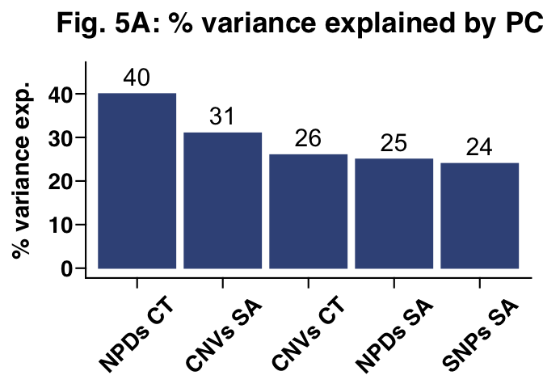
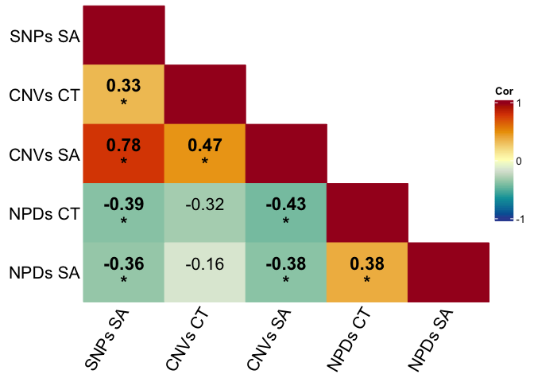
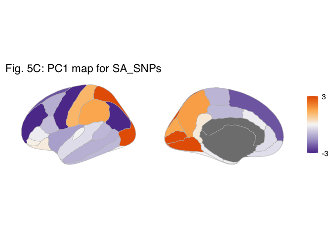
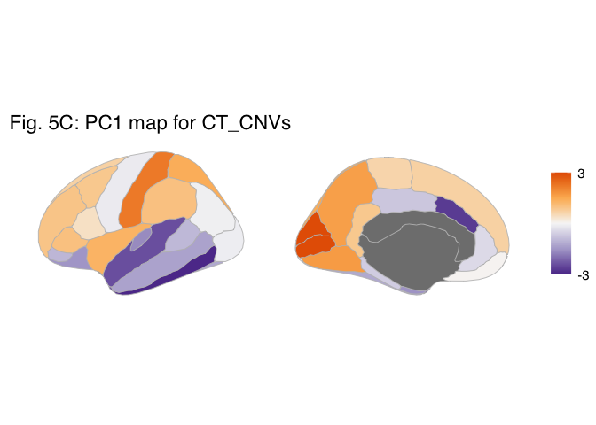
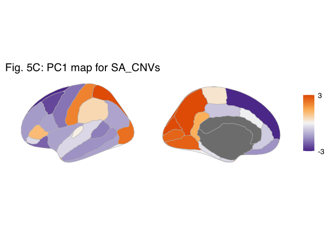
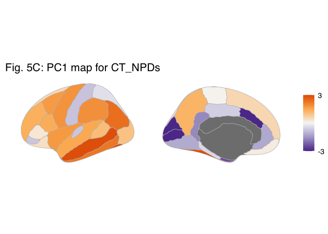
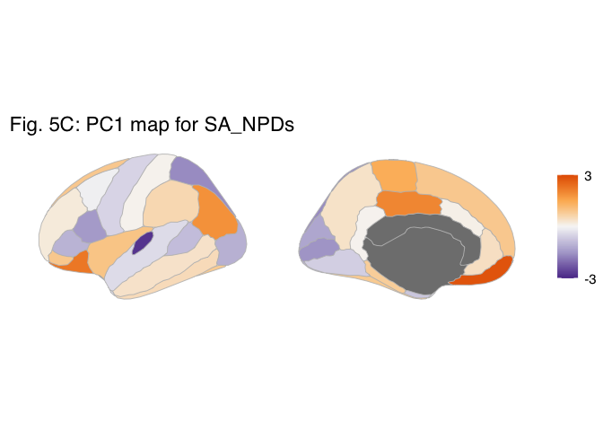
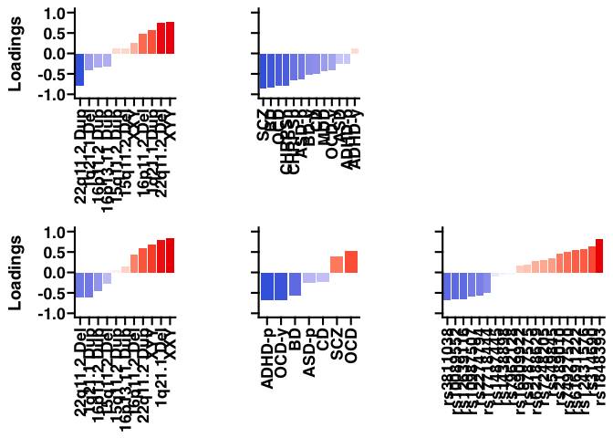

Fig5
================

## Fig. 5: statistics and panel figures

Panel A) the variance explained by the first principal component (PC1)
for neurodevelopmental and psychiatric disorders (NPDs), their
associated common and rare genetic variants. B) Correlation between
latent dimensions. Pairwise spatial correlations between PC1 for CT and
SA across NPDs, and associated common and rare genetic variants. C)
Correlation between the cortical gradient and the latent dimension of
cortical differences. Plots are arranged along the
sensorimotor-association axis based on correlation with cortical
gradient (transcriptomic, AHBA gene expression principal component).
Positive and negative correlation values indicate greater similarity
with association and sensorimotor cortical regions, respectively. D) PC1
variable loadings for NPDs and genetic variants.

## Plot Fig. 5 A: Variance explained by the latent dimensions (PC1)

``` r
library(ggplot2)
library(ggprism)   # we use ggprism theme
library(ggrepel)
library(dplyr)
```

    ## 
    ## Attaching package: 'dplyr'

    ## The following objects are masked from 'package:stats':
    ## 
    ##     filter, lag

    ## The following objects are masked from 'package:base':
    ## 
    ##     intersect, setdiff, setequal, union

``` r
library(circlize)
```

    ## ========================================
    ## circlize version 0.4.16
    ## CRAN page: https://cran.r-project.org/package=circlize
    ## Github page: https://github.com/jokergoo/circlize
    ## Documentation: https://jokergoo.github.io/circlize_book/book/
    ## 
    ## If you use it in published research, please cite:
    ## Gu, Z. circlize implements and enhances circular visualization
    ##   in R. Bioinformatics 2014.
    ## 
    ## This message can be suppressed by:
    ##   suppressPackageStartupMessages(library(circlize))
    ## ========================================

``` r
library(ComplexHeatmap)
```

    ## Loading required package: grid

    ## ========================================
    ## ComplexHeatmap version 2.14.0
    ## Bioconductor page: http://bioconductor.org/packages/ComplexHeatmap/
    ## Github page: https://github.com/jokergoo/ComplexHeatmap
    ## Documentation: http://jokergoo.github.io/ComplexHeatmap-reference
    ## 
    ## If you use it in published research, please cite either one:
    ## - Gu, Z. Complex Heatmap Visualization. iMeta 2022.
    ## - Gu, Z. Complex heatmaps reveal patterns and correlations in multidimensional 
    ##     genomic data. Bioinformatics 2016.
    ## 
    ## 
    ## The new InteractiveComplexHeatmap package can directly export static 
    ## complex heatmaps into an interactive Shiny app with zero effort. Have a try!
    ## 
    ## This message can be suppressed by:
    ##   suppressPackageStartupMessages(library(ComplexHeatmap))
    ## ========================================

``` r
library(ggseg)
library(ggpubr)

## Load data for 5A: Variance explained by PC1
load(file=paste0("data_fig5a_var_exp_PC1.RData"))

in_df_barplot_varexp = data_fig5a
                                 
in_df_barplot_varexp = in_df_barplot_varexp[order(in_df_barplot_varexp$varexp,decreasing = TRUE),]

in_df_barplot_varexp$name_vec = factor(in_df_barplot_varexp$name_vec,levels = c(in_df_barplot_varexp$name_vec))

p_bar_var = ggplot(data = in_df_barplot_varexp,aes(x=name_vec, y=varexp))+
  theme_prism(base_line_size = 0.75,base_size = 22) +
  geom_bar(stat="identity",color="#3c5488",fill= "#3c5488") +
  geom_text(aes(y =varexp, label = varexp), vjust = -0.5, size = 8) + 
  theme(axis.text.x = element_text(angle = 45, vjust = 0.5, hjust=0.5))+
  ylim(0,45)+
  theme(legend.position = "none")+
  xlab(NULL) + ylab("% variance exp.") + 
  ggtitle("Fig. 5A: % variance explained by PC1")

print(p_bar_var)
```

<!-- -->

## Fig. 5 B: Correlation between latent dimensions (PC1)

``` r
## 1. load data for Fig. 5B
load(file=paste0("data_fig5_concensus_profiles_meanAbsES_variance_significance_latentDimPC1.RData"))


# function to compute correlation with a reference profile + spin permutation p-value
load("df_perm_ids_DesikanLH34_nIterNull_10000.RData")  # pre-compute NULL spin rotations

# # A .------ Spin Perm test --------------------
get_pspin = function(x,y,perm.id,corr.type='pearson') {
  
  nroi = dim(perm.id)[1]  # number of regions
  nperm = dim(perm.id)[2] # number of permutations
  
  corr_emp = cor(x,y,method=corr.type)  # empirical correlation
  
  # permutation of measures
  x.perm = y.perm = array(NA,dim=c(nroi,nperm))
  for (r in 1:nperm) {
    for (i in 1:nroi) {
      x.perm[i,r] = x[perm.id[i,r]]
      y.perm[i,r] = y[perm.id[i,r]]
    }
  }
  
  # correlation to unpermuted measures
  rho.null.xy = rho.null.yx = vector(length=nperm)
  for (r in 1:nperm) {
    rho.null.xy[r] = cor(x.perm[,r],y,method=corr.type)
    rho.null.yx[r] = cor(y.perm[,r],x,method=corr.type)
  }
  
  # p-value definition depends on the sign of the empirical correlation
  if (corr_emp>0) {
    p_xy = sum(rho.null.xy>corr_emp)/nperm
    p_yx = sum(rho.null.yx>corr_emp)/nperm
  } else {
    p_xy = sum(rho.null.xy<corr_emp)/nperm
    p_yx = sum(rho.null.yx<corr_emp)/nperm
  }
  
  # return average p-value
  pval_avg <- (p_xy+p_yx)/2
  
  # check if p-value is 0; set to minimum or 1/nperm
  if(pval_avg == 0){
    pval_avg = 1/nperm
  }
  
  return(pval_avg)
  
}


### Function to compute correlation and spin permutation p-values between two matrices
fCompute_cor_pspin_mat1_vs_mat2 = function(df_map_mat,df_map_mat2){
  
  corr.type='pearson'
  
  array_map_name1 = c()
  array_map_name2 = c()
  array_cor_vals = c()
  array_pspin_vals = c()
  mat_cor = c()
  mat_pval = c()
  for( loop_b in c(1:ncol(df_map_mat2))){
    array_2 = df_map_mat2[,loop_b]
    array_cor = c()
    array_psin = c()
    for( loop_a in c(1:ncol(df_map_mat))){
      array_map_name2 = c(array_map_name2,colnames(df_map_mat2)[loop_b])
      array_map_name1 = c(array_map_name1,colnames(df_map_mat)[loop_a])
      
      temp_cor = cor(df_map_mat[c(1:34),loop_a],array_2)
      temp_pspin = get_pspin(df_map_mat[c(1:34),loop_a],array_2,perm.id = df_perm_ids_LH,corr.type=corr.type)
      
      array_cor_vals = c(array_cor_vals,temp_cor)
      array_pspin_vals = c(array_pspin_vals,temp_pspin)
      array_cor = c(array_cor,temp_cor)
      array_psin = c(array_psin,temp_pspin)
    }
    mat_cor = cbind(mat_cor,array_cor)
    mat_pval = cbind(mat_pval,array_psin)
  }
  
  
  df_cor_pspin_mat1_v_mat2 = data.frame( map_name1 = array_map_name1,
                                         map_name2 = array_map_name2,
                                         cor = array_cor_vals,
                                         pspin = array_pspin_vals)
  
  df_cor_mat = as.data.frame(mat_cor)
  df_pspin_mat = as.data.frame(mat_pval)
  
  rownames(df_cor_mat) = rownames(df_pspin_mat) = colnames(df_map_mat)
  colnames(df_cor_mat) = colnames(df_pspin_mat) = colnames(df_map_mat2)
  
  res_list = list(df_cor_pspin_mat1_v_mat2,df_cor_mat,df_pspin_mat)
  
  return(res_list)
}


## Function: make Corrplot using ComplexHeatmap
fCorHeatmap_single_mat_Tril <- function(mat_corr,mat_pval,array_names){
  
  nm = array_names
  M <- as.matrix(mat_corr)
  M_round <- as.matrix(round(mat_corr,2))
  pMat <- as.matrix(mat_pval)
  
  # ------- temp_labels ------  star for p-spin < 0.05------
  mat_labels_Corr_Pval_stars <- matrix(data=NA,nrow=nrow(pMat),ncol=ncol(pMat))
  for( loop_row in c(1:nrow(pMat))){
    for( loop_col  in c(1:ncol(pMat))){
      
      if( loop_row == loop_col){
        temp_star <- " "
        temp_label <- ""
      } else {
        if(pMat[loop_row,loop_col] < 0.05){
          temp_star <- "*"
        } else {
          temp_star <- " "
        }
        temp_label <- paste(round(mat_corr[loop_row,loop_col],2),"\n",temp_star,sep="")
      }
      
      mat_labels_Corr_Pval_stars[loop_row,loop_col] <- temp_label
    }
  }
  
  #-------------------------------------------------------
  
  diag(pMat) <- 1
  diag(M) <- 1
  
  in_angle_rot_column_names <- 60
  flag_dendogram <- FALSE
  in_fontsize_stars <- 16
  in_fontsize_axis_labels <- 16
  
  col_fun = circlize::colorRamp2(c(-1, 0, 1), hcl_palette = "RdYlBu", reverse = TRUE)   
  
  ht = Heatmap(M, name = "Corr", rect_gp = gpar(type = "none"),
               cluster_rows = FALSE, cluster_columns = FALSE,
               column_names_rot = in_angle_rot_column_names,
               row_names_gp = gpar(fontsize = in_fontsize_axis_labels),
               column_names_gp = gpar(fontsize = in_fontsize_axis_labels),
               row_names_side="left",
               col = col_fun,
               # add * for p-value using cell_fun
               cell_fun = function(j, i, x, y, width, height, fill) {
                 if(i >= j) {
                   grid.rect(x = x, y = y, width = width, height = height,
                             gp = gpar(col = fill, fill = fill))
                   
                   if( pMat[i, j] < 0.05 ){
                     grid.text(sprintf("%s",mat_labels_Corr_Pval_stars[i,j]), x, y, gp = gpar(fontsize = in_fontsize_stars+1, fontface = "bold",col = "black")) 
                   } else {
                     grid.text(sprintf("%s",mat_labels_Corr_Pval_stars[i,j]), x, y, gp = gpar(fontsize = in_fontsize_stars, fontface = "plain",col = "black"))
                   }
                 }
                 
               }, show_column_dend = flag_dendogram, show_row_dend = flag_dendogram,
               row_title = NULL, column_title = NULL,
               heatmap_legend_param = list(title = "Cor", at = c(-1, 0, 1), legend_gp = gpar(fontsize = in_fontsize_axis_labels),
                                           legend_height = unit(4, "cm"),grid_width = unit(0.6, "cm"),
                                           labels = c("-1", "0", "1"))
  )
  
  
  return(ht)
  
}


input_array_names = c("SNPs SA","CNVs CT","CNVs SA","NPDs CT","NPDs SA")

# Compute pair-wise correlation and spin permutation p-values
res_list = fCompute_cor_pspin_mat1_vs_mat2(df_map_mat = df_concensus_profiles_latentDim_PC1,df_map_mat2 = df_concensus_profiles_latentDim_PC1)

mat_cor = res_list[[2]]
mat_pspin = res_list[[3]]
  
rownames(mat_cor) = colnames(mat_cor) = input_array_names
rownames(mat_pspin) = colnames(mat_pspin) = input_array_names
  
  ht = fCorHeatmap_single_mat_Tril(mat_cor,mat_pval=mat_pspin,array_names = input_array_names)
  
  print("Fig. 5B: Correlation between PC1")
```

    ## [1] "Fig. 5B: Correlation between PC1"

``` r
  draw(ht)
```

<!-- -->

## Plots Fig. 5 C: Brain-maps for PC1 profiles and correlation with cortical gradient

``` r
## Compute correlations between PC1 profiles and cortical gradient

cor_pspin_with_gradient = function(df_map_mat,ref_profile,df_perm_ids_LH,corr.type){
  
  array_map_name = c()
  array_cor = c()
  array_pspin = c()
    for( loop_a in c(1:ncol(df_map_mat))){
      
      array_map_name = c(array_map_name,colnames(df_map_mat)[loop_a])
      
      temp_cor = cor(df_map_mat[c(1:34),loop_a],ref_profile)
      temp_pspin = get_pspin(df_map_mat[c(1:34),loop_a],ref_profile,perm.id = df_perm_ids_LH,corr.type=corr.type)
      
      array_cor = c(array_cor,temp_cor)
      array_pspin = c(array_pspin,temp_pspin)
    }
  
  df_cor_pspin_with_ref = data.frame(map = array_map_name,
                                     cor = array_cor,
                                     pspin = array_pspin)
  
  return(df_cor_pspin_with_ref)
}


## Correlation with gradient (transcriptomics: PC1 of AHBA gene-expression)

df_cor_pspin_with_gradient_fig5c = cor_pspin_with_gradient(df_map_mat = df_concensus_profiles_latentDim_PC1,ref_profile = array_cortical_gradient,df_perm_ids_LH,corr.type="pearson")
 
print("Statistics Fig. 5C: correlations of PC1 profiles with cortical gradient")
```

    ## [1] "Statistics Fig. 5C: correlations of PC1 profiles with cortical gradient"

``` r
print(df_cor_pspin_with_gradient_fig5c)
```

    ##       map        cor   pspin
    ## 1 SA_SNPs -0.4945955 0.01100
    ## 2 CT_CNVs -0.6911137 0.00055
    ## 3 SA_CNVs -0.5928766 0.00860
    ## 4 CT_NPDs  0.2028546 0.16640
    ## 5 SA_NPDs  0.3181815 0.02310

``` r
## Make Brain-maps for PC1 latent profiles

#Function to make single Brain maps for Cohen's D using ggseg-------
fBrainPlot_ggseg_Cortex_LH_RH_pos_neg_values <- function(array_es,in_legtitle,in_hem,cbar_min,cbar_max){
  
  in_atlas_name = "dk"
  
  # limit within the max values of cbar
  array_es[array_es < cbar_min] = cbar_min
  array_es[array_es > cbar_max] = cbar_max
  
  pallete_ggseg = dk$palette
  ggseg_region_names <- names(pallete_ggseg)
  #Note: ggseg dk has >"corpus callosum"   at index 4 (so add NA accordingly)
  array_es1 = c(array_es[c(1:3)],NA,array_es[c(4:34)],array_es[c(35:37)],NA,array_es[c(38:68)])
  
  
  # create df with estimate and p-value
  temp_df <- as.data.frame(cbind(array_es1))
  colnames(temp_df) <- c("ES")
  
  # Create data tibble with "region" column
  someData <- tibble(
    region = c(ggseg_region_names,ggseg_region_names),
    hemi  = c(rep("left",length(ggseg_region_names)),rep("right",length(ggseg_region_names))),
    effect = temp_df[,"ES"] )
  
  
  p_stacked = ggplot(data=someData) +
    geom_brain(
      atlas = dk, 
      #show.legend = FALSE,
      hemi = 'left',
      #position = position_brain(side ~ hemi ),
      #position = position_brain(hemi ~ side),
      aes(fill = effect,size=I(0.3)), 
      colour = "grey",
      size = 0.3
    ) +
    theme_brain(text.family = "sans",text.size = 14)+
    theme(axis.text.x = element_blank(),axis.text.y = element_blank()) +
    scale_fill_gradientn(limits = c(cbar_min,cbar_max),breaks=c(cbar_min,cbar_max),
                         colours = alpha(colorRampPalette(c('#5e3c99','#b2abd2','#f7f7f7','#fdb863','#e66101'))(n = 100)),1) 
  
  
  # legend on right
  p_stacked_legend_right = p_stacked +  theme(legend.position = "right") +  
    guides(fill = guide_colourbar(title = NULL,
                                  title.position = "top", 
                                  title.hjust =0.5,
                                  title.vjust = 0.9)) +
    theme(legend.margin=margin(t = 0, unit='cm'))
  
  # return single plot and legend
  return(p_stacked_legend_right)
}


## Make Brain maps for each PC

cbar_min = -3
cbar_max = 3

in_legtitle = "PC1"
array_map_names = colnames(df_concensus_profiles_latentDim_PC1)

for( loop_map in c(1:ncol(df_concensus_profiles_latentDim_PC1))){
  
  
    array_es = df_concensus_profiles_latentDim_PC1[,loop_map]
    p_stacked_legend_right = fBrainPlot_ggseg_Cortex_LH_RH_pos_neg_values(array_es,in_legtitle,in_hem,cbar_min,cbar_max)
    
    temp_title = paste0("Fig. 5C: PC1 map for ",array_map_names[loop_map])
    p_stacked_legend_right = p_stacked_legend_right +
  ggtitle(temp_title)
      
    print(p_stacked_legend_right)
    
}
```

    ## merging atlas and data by 'region', 'hemi'

<!-- -->

    ## merging atlas and data by 'region', 'hemi'

<!-- -->

    ## merging atlas and data by 'region', 'hemi'

<!-- -->

    ## merging atlas and data by 'region', 'hemi'

<!-- -->

    ## merging atlas and data by 'region', 'hemi'

<!-- -->

## Plots Fig. 5D: PC1 variable loadings

``` r
## Load data for Fig 5D
load(file=paste0("data_fig5d_PC1_variable_loadings.RData"))

### Function to make barplot for PC1 loadings
fBarplot_PC1_loadings_out_plot = function(data_var_loadings){
  #--- Bar plot for PC1
  in_df_barplot = as.data.frame(data_var_loadings)
  colnames(in_df_barplot) = paste0("PC",c(1:ncol(in_df_barplot)))
  in_df_barplot[,"name_vec"] = rownames(in_df_barplot)
  
  # order by PC1
  in_df_barplot = in_df_barplot[order(in_df_barplot[,"PC1"]),]
  in_df_barplot[,"name_vec"] = factor(in_df_barplot[,"name_vec"],levels = in_df_barplot[,"name_vec"])
  
  p_bar = ggplot(data = in_df_barplot,aes(x=name_vec, y=PC1, fill = PC1))+
    theme_prism(base_line_size = 0.75) +
    geom_bar(stat="identity") +
    scale_fill_gradient2(name = "Loadings", low ="royalblue", mid = "white", high = "red2")+
    theme(axis.text.x = element_text(angle = 90, vjust = 0.5, hjust=1))+
    ylim(-1,1)+theme(legend.position = "none")+
    xlab(NULL) + ylab("Loadings")
  
  return(p_bar)
}


## 1. CNVs CT
p_bar_CNVs_CT = fBarplot_PC1_loadings_out_plot(col_loadings_CT_CNVs)
## 2. NPDs CT
p_bar_NPDs_CT = fBarplot_PC1_loadings_out_plot(col_loadings_CT_NPDs)
## 3. CNVs SA
p_bar_CNVs_SA = fBarplot_PC1_loadings_out_plot(col_loadings_SA_CNVs)
## 4. NPDs SA
p_bar_NPDs_SA = fBarplot_PC1_loadings_out_plot(col_loadings_SA_NPDs)
## 5. PGC SNPs SA
p_bar_SNPs_SA = fBarplot_PC1_loadings_out_plot(col_loadings_SA_SNPs)

p_bar_stacked = ggarrange(p_bar_CNVs_CT,p_bar_NPDs_CT + theme(axis.title.y = element_blank(),axis.text.y = element_blank()),NULL,
                          p_bar_CNVs_SA,p_bar_NPDs_SA + theme(axis.title.y = element_blank(),axis.text.y = element_blank()),p_bar_SNPs_SA + theme(axis.title.y = element_blank(),axis.text.y = element_blank()),
                          align='hv', widths = c(0.3,0.3,0.4,0.3,0.3,0.4),
                          nrow = 2,ncol = 3)


temp_title = paste0("Fig 5D: PC1 variable loadings")
p_bar_stacked = p_bar_stacked + ggtitle(temp_title)

print(p_bar_stacked)
```

<!-- -->
